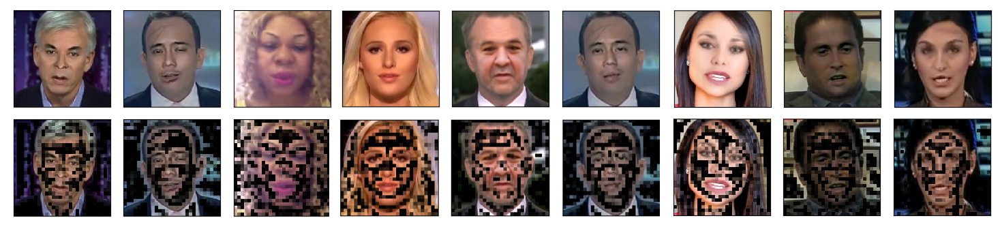

# Video Face Manipulation Detection Through Ensemble of CNNs
[](https://paperswithcode.com/sota/deepfake-detection-on-dfdc?p=video-face-manipulation-detection-through)
[](https://paperswithcode.com/sota/deepfake-detection-on-faceforensics-1?p=video-face-manipulation-detection-through)




This is the official repository of **Video Face Manipulation Detection Through Ensemble of CNNs**,
accepted to [ICPR2020](https://www.micc.unifi.it/icpr2020/) and currently available on [arXiv](https://arxiv.org/abs/2004.07676).

We participated as the **ISPL** team in the [Kaggle Deepfake Detection Challenge](https://www.kaggle.com/c/deepfake-detection-challenge/).
With this implementation, we reached the 41st position over 2116 teams (**top 2%**) on the [private leaderboard](https://www.kaggle.com/c/deepfake-detection-challenge/leaderboard).

This repository is currently under maintenance, if you are experiencing any problems, please open an [issue](https://github.com/polimi-ispl/icpr2020dfdc/issues).
## Getting started

### Prerequisites
- Install [conda](https://docs.conda.io/en/latest/miniconda.html)
- Create the `icpr2020` environment with *environment.yml*
```bash
$ conda env create -f environment.yml
$ conda activate icpr2020
```

### Quick run
If you just want to test the pre-trained models against your own videos or images:
- [Video prediction notebook](https://github.com/polimi-ispl/icpr2020dfdc/blob/master/notebook/Video%20prediction.ipynb)
- [Image prediction notebook](https://github.com/polimi-ispl/icpr2020dfdc/blob/master/notebook/Image%20prediction.ipynb)

### The whole pipeline
You need to preprocess the datasets in order to index all the samples and extract faces. Just run the script [make_dataset.sh](scripts/make_dataset.sh)

```bash
$ ./scripts/make_dataset.sh
```

Please note that we use only 32 frames per video. You can easily tweak this parameter in [extract_faces.py](extract_faces.py)

### Celeb-DF (v2)
Altough **we did not use this dataset in the paper**, we provide a script [index_celebdf.py](index_celebdf.py) to index the videos similarly to 
DFDC and FF++. Once you have the index, you can proceed with the pipeline starting from [extract_faces.py](extract_faces.py). You can also use the 
split `celebdf` during training/testing.

### Train
In [train_all.sh](scripts/train_all.sh) you can find a comprehensive list of all the commands to train the models presented in the paper. 
Please refer to the comments in the script for hints on their usage. 

#### Training a single model
If you want to train some models without lunching the script:
- for the **non-siamese** architectures (e.g. EfficientNetB4, EfficientNetB4Att), you can simply specify the model in [train_binclass.py](train_binclass.py) with the *--net* parameter;
- for the **siamese** architectures (e.g. EfficientNetB4ST, EfficientNetB4AttST), you have to:
  1. train the architecture as a feature extractor first, using the [train_triplet.py](train_triplet.py) script and being careful of specifying its name with the *--net* parameter **without** the ST suffix. For instance, for training the EfficientNetB4ST you will have to first run `python train_triplet.py --net EfficientNetB4 --otherparams`;
  2. finetune the model using [train_binclass.py](train_binclass.py), being careful this time to specify the architecture's name **with** the ST suffix and to insert as *--init* argument the path to the weights of the feature extractor trained at the previous step. You will end up running something like `python train_binclass.py --net EfficientNetB4ST --init path/to/EfficientNetB4/weights/trained/with/train_triplet/weights.pth --otherparams`

### Test 
In [test_all.sh](scripts/test_all.sh) you can find a comprehensive list of all the commands for testing the models presented in the paper. 

#### Pretrained weights
We also provide pretrained weights for all the architectures presented in the paper. 
Please refer to this [Dropbox link](https://www.dropbox.com/sh/cesamx5ytd5j08c/AADG_eEmhskliMaT0Gbk-yHDa?dl=0).
Each directory is named `$NETWORK_$DATASET` where `$NETWORK` is the architecture name and `$DATASET` is the training dataset.
In each directory, you can find `bestval.pth` which are the best network weights according to the validation set.


Additionally, you can find notebooks for results computations in the [notebook](notebook) folder.

## Datasets
- [Facebook's DeepFake Detection Challenge (DFDC) train dataset](https://www.kaggle.com/c/deepfake-detection-challenge/data) | [arXiv paper](https://arxiv.org/abs/2006.07397)
- [FaceForensics++](https://github.com/ondyari/FaceForensics/blob/master/dataset/README.md) | [arXiv paper](https://arxiv.org/abs/1901.08971)
- [Celeb-DF (v2)](http://www.cs.albany.edu/~lsw/celeb-deepfakeforensics.html) | [arXiv paper](https://arxiv.org/abs/1909.12962) (**Just for reference, not used in the paper**)

## References
- [EfficientNet PyTorch](https://github.com/lukemelas/EfficientNet-PyTorch)
- [Xception PyTorch](https://github.com/tstandley/Xception-PyTorch)

## Credits
[Image and Sound Processing Lab - Politecnico di Milano](http://ispl.deib.polimi.it/)
- Nicolò Bonettini
- Edoardo Daniele Cannas
- Sara Mandelli
- Luca Bondi
- Paolo Bestagini
